# Curso Rápido de Vim

Hace un tiempo empece a utilizar vi como editor de texto en el proceso aprendí a "las malas" como dicen algunos; el siguiente documento es una guía para aquellos que quieran empezar a usar vi, la misma está organizada de la siguiente forma: empezaremos con los comandos básicos de Vim, para abrir, cerrar y guardar archivos; luego veremos como podemos navegar dentro del editor; después se hablará de la edición de texto, insertar, eliminar, copiar, cortar y pegar texto; pasaremos después a ver el funcionamiento de los comandos *undo* y *redo*; seguido a esto veremos como remplazar y cambiar palabras; para después ver algunos comandos, que nos pueden ayudar bien sea para ejecutar comandos de Shell estando en Vim, abrir más de un archivo en el mismo editor e identificar el idioma (*Grammar Check*) de nuestro archivo y finalmente veremos como podemos configurar el archivo *.vimrc* y agregar *plugins* a nuestro editor.

### Comandos básicos de Vim

Para empezar asumo que ya tienes instalado Vim en tu equipo si no es así puedes revisar [este enlace](https://www.vim.org/) a la página oficial de Vim, una vez instalado podemos comenzar.

Para iniciar vim, en mi caso (Linux) solo debes escribir en la terminal la palabra *vi*

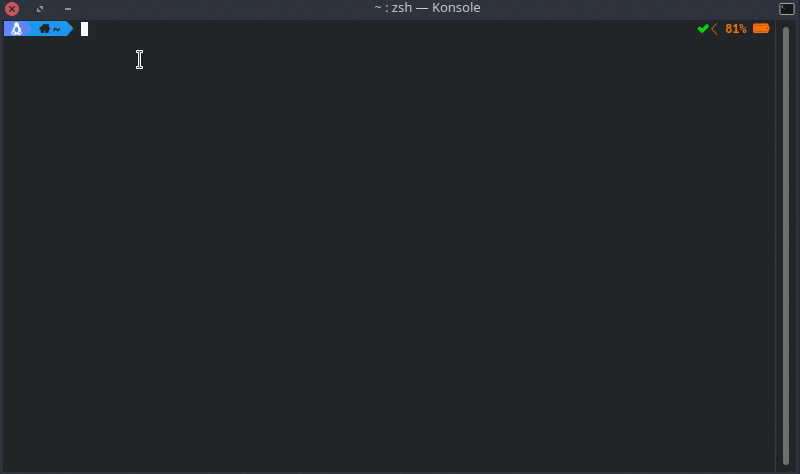

En el caso de Windows solo debes ejecutar la aplicación y te saldrá una ventana como la siguiente

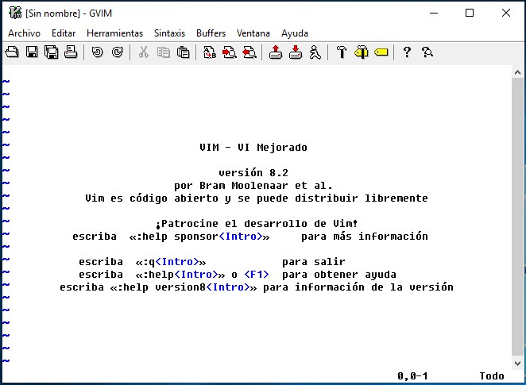

Una vez dentro de editor debes saber que en Vim hay diferentes *modos* el modo inicial (en el que estas apenas entras al editor) o modo por defecto; (también llamado modo normal) los comandos que más se usan en Vim son: *:q*, para salir del editor; *:w*, para guardar los cambios sin salir del editor, *:wq*, para guardar y salir; y *:q!* para salir son guardar cambios, para ingresar los comandos solamente debes de estar en el **modo normal** y escribir *:comando* para salir de cualquier modo en Vim debes presionar la tecla *Esc*.    


Ahora hablemos un poco más de los *modos* que mencionamos anteriormente, Vim usa diferentes modos para: navegar dentro del texto, insertar texto, seleccionar texto e ingresar comandos Empecemos por ver como navegar dentro de Vim

### Navegar dentro del texto

Para navegar en Vim, tradicionalmente se usan las teclas: *h j k l* las cuales se usan para moverse de: derecha, abajo, arriba e izquierda respectivamente, como lo muestra esta lista:

1. h = &rarr;

2. j = &darr;

3. k = &uarr;

4. l = &larr;   

En caso tal de que quieras moverte más rápido puedes usar la tecla *w* la cual te lleva al **inicio de la palabra siguiente**, como se ve en la imagen:


Para movernos hacia el **inicio de la palabra anterior**, lo haremos con la tecla *b*

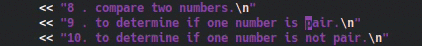

Finalmente para movernos al **final de la palabra siguiente** lo haremos con la tecla *e*

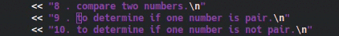

Quizá quieras moverte una cantidad *'n'* de palabras (hacia *arriba, abajo, izquierda o derecha*), para ello puedes combinar los operadores *h, j, k, l, w, b, e* con el número *'n'* de palabras que deseas moverte, por ejemplo si quieres ir cuatro **palabras** **delante del cursor** lo harías con *4 + w*.


De igual forma si lo que quieres es moverte cuatro **palabras detrás del cursor** lo harías con *4 + b*, si por alguna razón quieres moverte cuatro **letras delante del cursor** lo podrías hacer con *4 + l*.


Si estás pensando usar Vim para programar esto te va a ser útil, puedes ir a la definición de un método o una variable presionando *g + d*, en este ejemplo tenemos la variable *option* (el código no es importante)


Fíjate como desde diferentes partes del código la combinación de teclas nos lleva a la declaración de la variable.

Algo que quizá quieras hacer es ir a donde abriste y/o cerraste un *paréntesis, llave o corchete*, esto lo puedes hacer estando en el **modo normal** con el cursor sobre el *paréntesis, llave o corchete* (puede ser el de apertura o cierre) y presionando la tecla *%*, esto llevara al cursor al siguiente *paréntesis, llave o corchete* es decir, si por ejemplo estoy en la llave de apretura de un método lo que hará es llevarme a la llave de cierre de dicho método.


Veamos algo más interesante como podemos navegar entre archivos; en caso tal de que estemos importando alguna clase o librería propia y queramos ver su definición podemos ir hasta dicho archivo con las teclas *g + f* estando nuestro cursor sobre el llamado a dicha clase o librería

Nota: para poder hacer esto debes de haber guardado todos los cambios en el archivo actual.


Vim tiene un *Buffer de navegación* lo que quiere decir que la acción anterior creó una 'lista' de acciones, para **devolvernos a la acción anterior** en este punto (volver al archivo principal) lo que debemos hacer es presionar *Ctrl + o*


En caso tal de querer ir a la **"acción siguiente"** lo haríamos con *Ctrl + i*

Nota: ir a la definición de una variable o método también cuenta como una acción que se almacena en el *Buffer de navegación*, la navegación entre estas es exactamente igual (Ctrl + o y Ctrl + i).

Otra cosa que podríamos necesitar hacer es ir al principio, al final o a una línea  *'n'* del archivo, esto lo podemos hacer con: *g + g*,  *Shif + g* (la *'G'* mayúscula) y *'n' + G* (donde *'n'* es el número de la línea a la cual quieres ir), respectivamente.

Nota: con *Ctrl + G* verás en que linea te encuentras dentro de Vim (más adelante en *Configuración de Vim* te mostraré como habilitar los índices de las líneas al lado izquierdo del editor).


Supongamos a hora que quieres buscar una palabra en el archivo, esto lo puedes hacer con *'/palabra'* para buscar en el archivo **después del cursor**, y con *'?palabra'* para buscar **antes del cursor**.

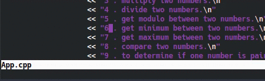

Una vez estemos ubicados en la palabra quizá queramos ir a la palabra siguiente (ten en cuanta que si buscaste con */palabra* la siguiente coincidencia estará **después** del cursor; y si buscaste con *?palabra* la siguiente coincidencia estará **antes** del cursor), para ello presionamos *Enter* y después *n*, si por alguna razón quieres ir a la coincidencia anterior lo puedes hacer con *N*


### Edición de texto

Para editar un archivo de texto en Vim debemos entrar al modo *INSERT* para ello debemos presionar la tecla *i* nos daremos cuenta de que estamos en este modo porque en la parte inferior izquierda del editor.

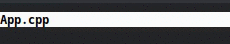

En este modo podremos empezar a editar partir del lugar donde esté ubicado nuestro cursor; en caso tal de que queramos editar algo justo después del lugar donde está ubicado nuestro cursor lo haríamos presionando la tecla *a*, ahora bien si queremos editar desde el final de la línea de texto lo hacemos con *shif + a* (con la 'a' mayúscula) esto ubicará nuestro cursor al final de la línea como se ve en la siguiente imagen:

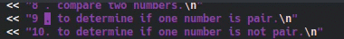

Supongamos que quieres agregar una nueva linea de comentario a tu código, esto lo puedes hacer con  la tecla *o* para agregar una nueva linea **debajo** de la línea en la cual se encuentra el cursor y *O* ('*O*' mayúscula) para agregar una línea **arriba** de donde está el cursor


Para eliminar texto **en el modo normal** lo haremos con presionando la tecla *x*

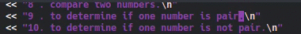

También puedes eliminar toda una línea de texto con *d + d* como se ve en la siguiente imagen:

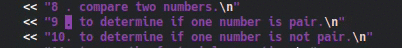

Si no quieres eliminar toda una línea si no lo que esta delante de una palabra por ejemplo puedes hacerlo con *d + shif + 4* (o lo que es lo mismo buscar la combinación de teclas *d + $*), que elimina todo lo que este delante del cursor, la siguiente imagen lo muestra un poco mejor:

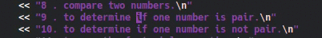

Antes te dije que podías navegar con las teclas *w, b, e* bueno con ellas también puedes eliminar; para eliminar la palabra (o fracción de ella) que esta **delante del cursor** puedes usar *d + w*

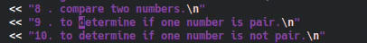

con *d + b* eliminas la palabra que este **antes del cursor**

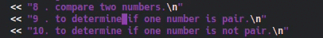

Supongamos ahora que quieres eliminar una cantidad *'n'* de palabras que están **delante de los cursos** ¿cómo lo harías?, muy sencillo *d + 'n' + w*, es decir si yo quiero eliminar las cuatro palabras que están delante de mi cursor lo puedo hacer con *d + 4 + w*, como se ve en la siguiente imagen:

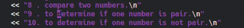

Esta demás decir que si lo que quieres es eliminar *'n'* palabras que están **antes del cursor** lo podrías hacer con *d + 'n' + b*.

Quizá te estés preguntando, si puedes copiar/cortar y pegar y la respuesta es claramente si, pero veamos como puedes hacerlo desde el **modo normal**, todas las opciones que te acabo de mostrar para eliminar, son en realidad una opción de *cortar* y para *pegar* usamos la tecla *p* y *Shif + p* (es decir la *'P'* mayúscula), veamos esto con un ejemplo supongamos que queremos *cortar y pegar* una línea de texto, ya vimos que con *d + d* podemos *"eliminar"* (ahora sabemos que en realidad es *cortar*) toda una línea de texto; en la siguiente imagen usamos la tecla *p* para pegar la línea **después de** la línea donde esta nuestro cursor.

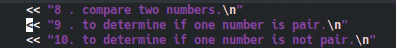

En caso tal que queramos *pegar* **antes de** la línea donde esta nuestro cursor lo haremos con *P*.

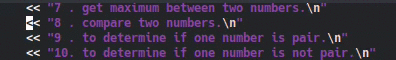

Ahora veamos la opción de copiar, para copiar un texto primero debemos seleccionarlo, ¿cómo seleccionamos texto en Vim? para esto existe el modo *Visual* en el cual entramos con la tecla *v*


Estando en este modo podremos seleccionar texto con sólo mover nuestro cursor


Una vez seleccionado el texto podremos copiarlo con la tecla *y* y pegarlo de la misma forma que hemos visto antes con la tecla *p*


Quizá en algún momento quieras copiar todo el contenido de un archivo de texto diferente a archivo en el que estas, esto lo puedes hacer con *:r archivo* lo que copiara el contenido de *archivo* en tu archivo actual.


Nota: más adelante en *Algunos comandos de Vim* veremos como seleccionar lineas especificar del texto con *:r* (para Linux)

### Deshacer y rehacer (undo  y redo)

Ahora que ya sabemos un poco más del uso de Vim, veamos como podemos deshacer y rehacer texto, el primero se hace simplemente con la tecla *u*

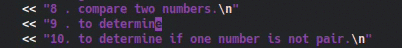

Si por casualidad quieres devolverte a un cambio en el cual hiciste x cantidad de cambios puedes ver la *undolist*, estando **en el modo normal** escrive *:undolist*

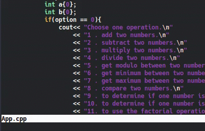

En esta lista se encuentran los cambios realizados sobre el archivo ordenados desde el menos reciente al más reciente de arriba hacia abajo, fíjate en las columnas de la lista etas son de izquierda a derecha *number*, número o identificador del cambio; *changes*, o cantidad de cambios realizados; *when*, que especifica cuando se realizó el cambio; si lo que quieres es devolverte a un cambio especifico lo que debes hacer es escribir *:undo N* donde *N* es el número o identificador del cambio.


Anterior mente habíamos hablado de *Buffers* en las acciones de Vim, con *undo* y *redo* pasa lo mismo si quieres volver al **cambio deshecho anterior** (redo) lo puedes hacer con *Ctrl + r*

### Remplazar y cambiar palabras

Veamos ahora como podemos remplazar palabras, si por ejemplo yo quiero remplazar un único carácter de una palabra lo puedo hacer ubicándome en la letra que quiero remplazar, seguido a esto presiono la tecla *r* y la nueva letra.

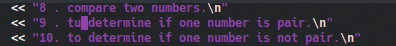

Si quieres cambiar más de una letra en la misma palabra puedes hacerlo con *R*


Por lo general necesitamos cambiar más de una sola letra, así que veamos como remplazar toda una palabra o parte de ella, en caso tal de que yo quiera remplazar toda una palabra lo puedo hacer con *c + i + w*

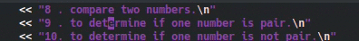

Para remplazar parte de la palabra usamos *c + w* esto es para remplazar la parte de la palabra que esta **delante** del cursor

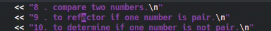

Nota: cuando usas a alguno de estos comandos debes presionar la tecla *Esc* para salir de alguno de estos modos.

Ahora veamos como podemos remplazar una palabra que se repite varias veces en el archivo (por ejemplo el nombre de una variable, o la llamada a un método), para esto tenemos estas opciones *:s/palabra/nuevaPalabra*, la cual encuentra la primera coincidencia (que esté en la línea donde tienes el cursor) con *'palabra'* y la remplaza por *'nuevaPalabra'*.


Si a la opción anterior le agregamos una *g*, es decir  *:s/palabra/nueva/g*, le estamos indicando al editor que cambie todas las coincidencias con *'palabra'* en la misma linea donde está el cursor por *'nuevaPalabra'*.


Si ahora por ejemplo agregamos *%* al principio del comando, esto es *:%s/palabra/nueva/g*, lo que le estaremos indicando al editor es que cambie **todas** las coincidencias de *palabra* por *nuevaPalbra* en el archivo


¿Pero qué pasa si no quiero cambiar todas las palabras del documento? si agregas una *c* al final el editor te pedirá confirmación para remplazar las palabras, esto es  *:%s/palabraOriginal/nuevaPalabra/gc*


En la parte inferior aparecerán las siguientes opciones *y*, para confirmar el cambio; *n*, para omitirlo; *a*, para remplazar **todas** las coincidencias que están **después** del cursor; *l*, para cambiar la para coincidencia resaltada y salir de la operación; *q*, para salir de la operación; *^E* y *^Y* (esto es *Ctrl + e* y *Ctrl + y* respectivamente) para movernos hacia abajo y hacia arriba en el documento mientras estamos en este modo.

### Algunos comandos de Vim

#### El comando *:!*

El comando *:!* es usado para ejecutar comandos de Shell mientras estas en una sesión de Vim


En la figura de arriba ejecute el comando *:! ls -la* para listar los archivos de la carpeta en la cual me encontraba, acto seguido se despliega la lista de archivos y al dar *Enter* regreso al editor, esto es particularmente útil si por ejemplo quieres ejecutar código cada vez que agregas funcionalidades al mismo.

Supongamos ahora que queremos crear un archivo de texto con información del equipo como la versión del kernel, este tipo de cosas se pueden lograr combinando el comando *:r* y *:!*, para este ejemplo particular sería con *:r ! uname -v*, el texto se insertará en el archivo en la **línea siguiente** en la cual se encuentra el cursor.


Anteriormente te dije que podías usar *:r archivo* para copiar todo el contenido de un archivo en Vim, veamos ahora como tomar solo las lineas que me interesan, esto lo haremos con ayuda de *:!*; si por ejemplo quiero tomar las líneas cinco a siete de otro archivo de texto lo puedo hacer con *:r !sed -n 5,7p archivo*


#### Comandos *Ex*, *Vex* y *Sex*

El comando *Ex* es la abreviatura de *Explore* y se usa para *explorar* dentro de la carpeta de archivos en la cual abriste Vim


En caso tal de que quieras volver al archivo anterior puedes volver a ejecutar *:Ex* y buscar el archivo, o también puedes aprovechar el *Buffer* de navegación que ya conocemos (*Ctrl +o* y *Ctrl + i* para navegar hacia adelante y hacia atrás)


Los comandos *Vex* y *Sex* son algo parecidos, *Sex* usan para abrir el directorio actual de forma horizontal y *Vex* los habré de forma vertical, de esta forma podemos abrir dos (o más) archivos en el mismo editor de Vim.

Nota: Para salir de la ventana dividida usamos *:q* (o *:wq* si queremos guardar algún cambio en el archivo que hayamos abierto)


#### El comando *spell*

El comando *spell* es utilizado para verificar la gramatica del idioma que le indiquemos, por defecto en ingles (también te voy a explicar como configurarlo para español), si quieres verificar la ortografía de tu archivo usas el comando *:set spell*, el editor resaltara en rojo


Ahora, ¿cómo podemos corregir los errores?, con el cursor nos paramos en la palabra que queremos corregir y presionamos las teclas *z =*, nos aparecerá una lista con las posibles opciones para corregir la palabra, seleccionamos la opción por la cual queremos remplazar la palabra y damos enter.


Si estás leyendo esto, lo más probable es que seas de aula hispana y te interese tener esta opción para corregir palabras en español, bueno veamos ahora como configurar *spell* para español, para cambiar el idioma a español se utiliza el siguiente comando *:set spelllang=es*, en este caso particular Vim te marcara un error indicando que **no** tienes el paquete del idioma instalado, algo como esto:

```vim
spellfile#LoadFile(): There is no writable spell directory.
Shall I create ~/.wim/spell

Cannot find spell file for "es" in utf-8
Do you want me to try downloading it?
(Y)es, [N]o:
```

A lo cual presionaras *y*, acto seguido en la consola te aparecerá algo como esto:

```vim
Downloading fr.utf-8.spl...
:!curl 'http://ftp.vim.org/pub/vim/runtime/spell/es.utf-8.spl' -o '/tmp/v9SMuXV/0.spl'
  % Total    % Received % Xferd  Average Speed   Time    Time     Time  Current
                                 Dload  Upload   Total   Spent    Left  Speed
"/tmp/vu98ZTF/2.spl" [noeol] 1122L, 571626C
In which directory do you want to write the file:
1. /home/youruser/.vim/spell
[C]ancel, (1):
```

A lo cual deberás presionar *1* (si presionas *Enter* cancelaras el proceso), luego te saldrá esto:

```vim
This will improve making suggestions for spelling mistakes,
but it uses quite a bit of memory.
[N]o, (Y)es:
```

Después de darle *y* creará los archivos, *~/.vim/spell/es.utf-8.spl* y *~/.vim/spell/es.utf-8.sug* en caso tal de que presiones *n* no se descaran los archivos y no tendrás los paquetes del idioma.

Una vez instalados los paquetes podrás cambiar el idioma y usar el comando como ya lo hemos visto


### Configuración de Vim

Ahora vamos a ver como configurar nuestro archivo *.vimrc* para personalizar nuestro editor de texto, estos son algunos de los comandos que podemos usar para ello (si, también podemos dejar un idioma por defecto para no configurar *spell* en cada archivo que abramos), configurar el archivo *.vimrc* es tan sencillo como abrirlo y escribir los comandos que queremos aplicar a nuestro editor, como se ve en esta imagen.


Nota: la  camilla (*"*) se usa para dejar comentarios.

1. *set spelllang=es* " cambia el idioma a español, siempre y cuando hayas seguido los pasos de la sección anterior

2. *set number* " para habilitar los índices de la línea en el lado izquierdo del editor
   
   

3. *set mouse=a* " para poder interactuar con el mouse (si, no estás obligado a usar solamente el teclado en Vim)
   
   

4. *syntax enable* " habilita la sintaxis de lenguaje en Vim (que resalte con colores las palabras clave del lenguaje de programación, así como los tipos de datos)

5. *laststatus=2* "habilita la barra inferior del editor (en algunas imágenes de este documento se puede ver)
   
   

6. *set sw=2* " cambia el espacio de identado a dos espacios (por defecto Vim tiene el identado en **ocho espacios**)

7. *set relativenumber* " agrega la *posición relativa del cursor* es decir a cuantas líneas por arriba o por abajo están las demás de tu posición actual.
   
   

8. *set encoding=utf-8* " coloca los archivos que crees en formato *utf-8*

9. set wildmenu " despliega el menú de opciones con tab
   
   

### Plugins en Vim

Para finalizar, veamos como instalar Plugins (en [2] esta el enlace de dondo yo busco pluginsUntitled) en Vim y revisemos algunos que podrías ser útiles, otros que solo son para personalizar como por ejemplo los temas.

Para empezar debes instalar un gestor de plugins en este caso, vamos a usar [vim-plug](https://github.com/junegunn/vim-plug) puedes ir al repositorio y ver las  instrucciones para instalarlo según sea tu caso.

Una vez tengamos instalado nuestro gestor de plugings escribimos lo siguiente en nuestro archivo *.vimrc*

```vim
call plug#begin('~/.vim/plugged')
" los plugings aquí
call plug#end()
```

Ahora para cada plugin que quieras instalar debes usar la palabra clave *Plug* seguida del nombre del paquete del plugin que quieras instalar, por ejemplo para instalar el tema *forest-night* sería

```vim
call plug#begin('~/.vim/plugged')
" Temas
Plug 'sainnhe/forest-night'
call plug#end()
```

Luego debes escribir el comando *PlugInstall* para que el gestor de plugins lo instale, puedes revisar la documentación para más detalles [aquí](https://github.com/junegunn/vim-plug/wiki/tutorial)

Nota: en el caso de los temas debes de especificar que lo quieres dejar por defecto esto sería *colorscheme nombreDelTema* es decir:

```vim
call plug#begin('~/.vim/plugged')
" Temas
Plug 'sainnhe/forest-night'
call plug#end()
" Definor tema para Vim
colorscheme forest-night
```

El tema se ve así:


Un plugin que podría serte útil es nerdtree, agrega la navegación de archivos, para instalarlo, nuevamente usas la palabra clave *Plug*

```vim
call plug#begin('~/.vim/plugged')
" Temas
Plug 'sainnhe/forest-night'
" IDE
Plug 'scrooloose/nerdtree'

call plug#end()
" Definor tema para Vim
colorscheme forest-night
```

Ahora para utilizarlo debes de habilitar la *'tecla líder'*, en mi caso es un espacio (esta también es usada en otros plugins), y luego crear el atajo el *'alias'* del plugin, esto es agregar lo siguiente en *.vimrc*

```vim
call plug#begin('~/.vim/plugged')
" Temas
Plug 'sainnhe/forest-night'
" IDE
Plug 'scrooloose/nerdtree'

call plug#end()
" Definor tema para Vim
colorscheme forest-night
" Define Leader key
let mapleader=" "
nmap <Leader>nt :NERDTreeFind<CR>
```

Ahora te preguntarás, ¿cómo uso eso? es sencillo presionas *'tecla lider'* y seguido a esto presionas la combinación de teclas *nt* esto escribirá el comando *:NERDTreeFind* en la entrada de comandos ( *< CR >*  indica un *Enter*).


Ahora estarás pensando que es lo mismo que usar el comando *Vex* pero en este caso si presionas la tecla *m*, abrirás el menú de *nerdtree*, con el cual podemos gestionar los archivos (agregar, mover, eliminar, copiar, etc)

Pero para que este plugin sea un poco más útil (y de verdad tenga más diferencias con el comando *Vex o Sex*) vamos a instalar *vim-tmux-navigator* el cual nos permite navegar entre ventanas con el teclado

```vim
call plug#begin('~/.vim/plugged')
" Temas
Plug 'sainnhe/forest-night'
" IDE
Plug 'scrooloose/nerdtree'
Plug 'christoomey/vim-tmux-navigator'

call plug#end()
" Definor tema para Vim
colorscheme forest-night
" Define Leader key
let mapleader=" "
nmap <Leader>nt :NERDTreeFind<CR>
```

Con este último plugin instalado, al abrir nerdtree seleccionas el archivo que quieres abrir y con *Ctrl + l* y *Ctrl + h* podrás navegar entre archivos.


#### Crear atajos o *alias*

en el archivo de configuración *.vimrc* también podrías crear atajos o *alias* para los comandos que consideras que usas mas, por ejemplo para salir de Vim usamos *:q* podríasmos hacer un atajo para que sea unicamente con *q*

```vim
nmap <Leader>q :q<CR>
```

Ahora para salir del editor lo único que deberías de hacer es presionar la tecla *espacio + q* 


### Reaferencias y recursos

[1] *Vim: help.txt*. (n.d.). Retrieved June 23, 2020, from https://vimhelp.org/

[2] *Syntastic - Vim Awesome*. (n.d.). Retrieved June 23, 2020, from https://vimawesome.com/


