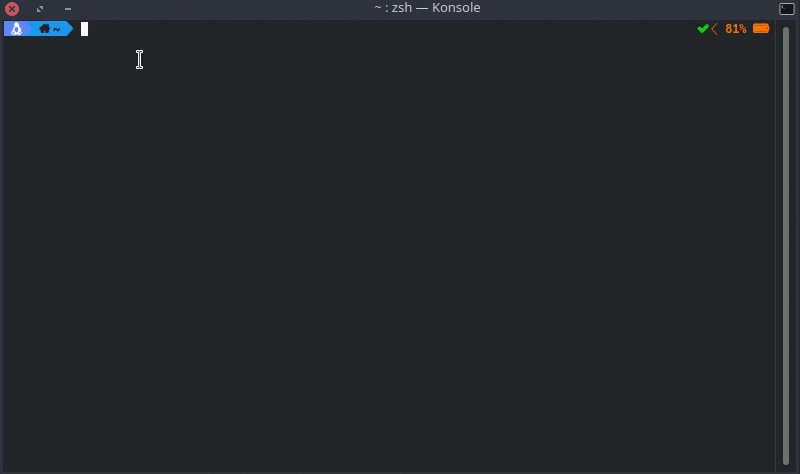
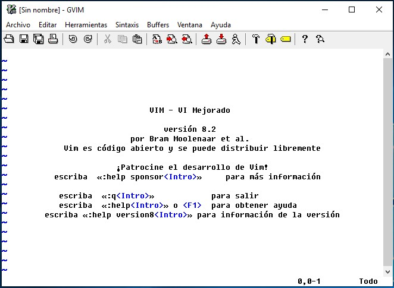

# Comandos Básicos

Para empezar asumo que ya tienes instalado Vim en tu equipo si no es así puedes revisar [este enlace](https://www.vim.org/) a la página oficial de Vim, una vez instalado podemos comenzar.

Para iniciar vim, en mi caso (Linux) solo debes escribir en la terminal la palabra *vi*

En el caso de Windows solo debes ejecutar la aplicación y te saldrá una ventana como la siguiente

Una vez dentro de editor debes saber que en Vim hay diferentes *modos* el modo inicial (en el que estas apenas entras al editor) o modo por defecto; (también llamado modo normal) los comandos que más se usan en Vim son: *:q*, para salir del editor; *:w*, para guardar los cambios sin salir del editor, *:wq*, para guardar y salir; y *:q!* para salir son guardar cambios, para ingresar los comandos solamente debes de estar en el **modo normal** y escribir *:comando* para salir de cualquier modo en Vim debes presionar la tecla *Esc*.    

Ahora hablemos un poco más de los *modos* que mencionamos anteriormente, Vim usa diferentes modos para: navegar dentro del texto, insertar texto, seleccionar texto e ingresar comandos Empecemos por ver como navegar dentro de Vim, [en este capitulo](capitulo2.md).
