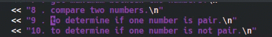
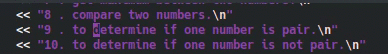
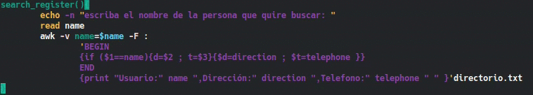
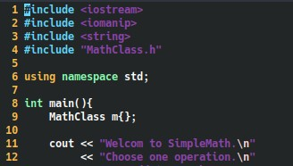

# Navegar dentro del texto

Para navegar en Vim, tradicionalmente se usan las teclas: *h j k l* las cuales se usan para moverse de: derecha, abajo, arriba e izquierda respectivamente, como lo muestra esta lista:

1. h = &rarr;

2. j = &darr;

3. k = &uarr;

4. l = &larr;   

En caso tal de que quieras moverte más rápido puedes usar la tecla *w* la cual te lleva al **inicio de la palabra siguiente**, como se ve en la imagen:

Para movernos hacia el **inicio de la palabra anterior**, lo haremos con la tecla *b*

Finalmente para movernos al **final de la palabra siguiente** lo haremos con la tecla *e*

Quizá quieras moverte una cantidad *'n'* de palabras (hacia *arriba, abajo, izquierda o derecha*), para ello puedes combinar los operadores *h, j, k, l, w, b, e* con el número *'n'* de palabras que deseas moverte, por ejemplo si quieres ir cuatro **palabras** **delante del cursor** lo harías con *4 + w*.

De igual forma si lo que quieres es moverte cuatro **palabras detrás del cursor** lo harías con *4 + b*, si por alguna razón quieres moverte cuatro **letras delante del cursor** lo podrías hacer con *4 + l*.

Si estás pensando usar Vim para programar esto te va a ser útil, puedes ir a la definición de un método o una variable presionando *g + d*, en este ejemplo tenemos la variable *option* (el código no es importante)

Fíjate como desde diferentes partes del código la combinación de teclas nos lleva a la declaración de la variable.

Algo que quizá quieras hacer es ir a donde abriste y/o cerraste un *paréntesis, llave o corchete*, esto lo puedes hacer estando en el **modo normal** con el cursor sobre el *paréntesis, llave o corchete* (puede ser el de apertura o cierre) y presionando la tecla *%*, esto llevara al cursor al siguiente *paréntesis, llave o corchete* es decir, si por ejemplo estoy en la llave de apretura de un método lo que hará es llevarme a la llave de cierre de dicho método.

Veamos algo más interesante como podemos navegar entre archivos; en caso tal de que estemos importando alguna clase o librería propia y queramos ver su definición podemos ir hasta dicho archivo con las teclas *g + f* estando nuestro cursor sobre el llamado a dicha clase o librería

Nota: para poder hacer esto debes de haber guardado todos los cambios en el archivo actual.

Vim tiene un *Buffer de navegación* lo que quiere decir que la acción anterior creó una 'lista' de acciones, para **devolvernos a la acción anterior** en este punto (volver al archivo principal) lo que debemos hacer es presionar *Ctrl + o*

En caso tal de querer ir a la **"acción siguiente"** lo haríamos con *Ctrl + i*

Nota: ir a la definición de una variable o método también cuenta como una acción que se almacena en el *Buffer de navegación*, la navegación entre estas es exactamente igual (Ctrl + o y Ctrl + i).

Otra cosa que podríamos necesitar hacer es ir al principio, al final o a una línea  *'n'* del archivo, esto lo podemos hacer con: *g + g*,  *Shif + g* (la *'G'* mayúscula) y *'n' + G* (donde *'n'* es el número de la línea a la cual quieres ir), respectivamente.

Nota: con *Ctrl + G* verás en que linea te encuentras dentro de Vim (más adelante en *Configuración de Vim* te mostraré como habilitar los índices de las líneas al lado izquierdo del editor).

Supongamos a hora que quieres buscar una palabra en el archivo, esto lo puedes hacer con *'/palabra'* para buscar en el archivo **después del cursor**, y con *'?palabra'* para buscar **antes del cursor**.

Una vez estemos ubicados en la palabra quizá queramos ir a la palabra siguiente (ten en cuanta que si buscaste con */palabra* la siguiente coincidencia estará **después** del cursor; y si buscaste con *?palabra* la siguiente coincidencia estará **antes** del cursor), para ello presionamos *Enter* y después *n*, si por alguna razón quieres ir a la coincidencia anterior lo puedes hacer con *N*

Ahora pasemos al [siguiente capitulo](capitulo3.md) en el que hablaremos de como editar texto.
