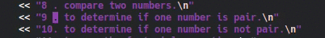
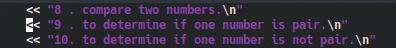

# Edición de Texto

Para editar un archivo de texto en Vim debemos entrar al modo *INSERT* para ello debemos presionar la tecla *i* nos daremos cuenta de que estamos en este modo porque en la parte inferior izquierda del editor.

En este modo podremos empezar a editar partir del lugar donde esté ubicado nuestro cursor; en caso tal de que queramos editar algo justo después del lugar donde está ubicado nuestro cursor lo haríamos presionando la tecla *a*, ahora bien si queremos editar desde el final de la línea de texto lo hacemos con *shif + a* (con la 'a' mayúscula) esto ubicará nuestro cursor al final de la línea como se ve en la siguiente imagen:

Supongamos que quieres agregar una nueva linea de comentario a tu código, esto lo puedes hacer con  la tecla *o* para agregar una nueva linea **debajo** de la línea en la cual se encuentra el cursor y *O* ('*O*' mayúscula) para agregar una línea **arriba** de donde está el cursor

Para eliminar texto **en el modo normal** lo haremos con presionando la tecla *x*

También puedes eliminar toda una línea de texto con *d + d* como se ve en la siguiente imagen:

Si no quieres eliminar toda una línea si no lo que esta delante de una palabra por ejemplo puedes hacerlo con *d + shif + 4* (o lo que es lo mismo buscar la combinación de teclas *d + $*), que elimina todo lo que este delante del cursor, la siguiente imagen lo muestra un poco mejor:

Antes te dije que podías navegar con las teclas *w, b, e* bueno con ellas también puedes eliminar; para eliminar la palabra (o fracción de ella) que esta **delante del cursor** puedes usar *d + w*

con *d + b* eliminas la palabra que este **antes del cursor**

Supongamos ahora que quieres eliminar una cantidad *'n'* de palabras que están **delante de los cursos** ¿cómo lo harías?, muy sencillo *d + 'n' + w*, es decir si yo quiero eliminar las cuatro palabras que están delante de mi cursor lo puedo hacer con *d + 4 + w*, como se ve en la siguiente imagen:

Esta demás decir que si lo que quieres es eliminar *'n'* palabras que están **antes del cursor** lo podrías hacer con *d + 'n' + b*.

Quizá te estés preguntando, si puedes copiar/cortar y pegar y la respuesta es claramente si, pero veamos como puedes hacerlo desde el **modo normal**, todas las opciones que te acabo de mostrar para eliminar, son en realidad una opción de *cortar* y para *pegar* usamos la tecla *p* y *Shif + p* (es decir la *'P'* mayúscula), veamos esto con un ejemplo supongamos que queremos *cortar y pegar* una línea de texto, ya vimos que con *d + d* podemos *"eliminar"* (ahora sabemos que en realidad es *cortar*) toda una línea de texto; en la siguiente imagen usamos la tecla *p* para pegar la línea **después de** la línea donde esta nuestro cursor.

En caso tal que queramos *pegar* **antes de** la línea donde esta nuestro cursor lo haremos con *P*.

Ahora veamos la opción de copiar, para copiar un texto primero debemos seleccionarlo, ¿cómo seleccionamos texto en Vim? Para esto existe el modo *Visual* en el cual entramos con la tecla *v*

Estando en este modo podremos seleccionar texto con sólo mover nuestro cursor

Una vez seleccionado el texto podremos copiarlo con la tecla *y* y pegarlo de la misma forma que hemos visto antes con la tecla *p*

Quizá en algún momento quieras copiar todo el contenido de un archivo de texto diferente a archivo en el que estas, esto lo puedes hacer con *:r archivo* lo que copiara el contenido de *archivo* en tu archivo actual.

Nota: más adelante en *Algunos comandos de Vim* veremos como seleccionar lineas especificar del texto con *:r* (para Linux).

En el [siguiente capitulo](capitulo4.md) veremos los comandos undo and redo. 
