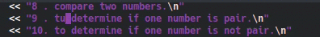
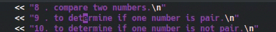

# Remplazar y cambiar palabras

Veamos ahora como podemos remplazar palabras, si por ejemplo yo quiero remplazar un único carácter de una palabra lo puedo hacer ubicándome en la letra que quiero remplazar, seguido a esto presiono la tecla *r* y la nueva letra.

Si quieres cambiar más de una letra en la misma palabra puedes hacerlo con *R*

Por lo general necesitamos cambiar más de una sola letra, así que veamos como remplazar toda una palabra o parte de ella, en caso tal de que yo quiera remplazar toda una palabra lo puedo hacer con *c + i + w*

Para remplazar parte de la palabra usamos *c + w* esto es para remplazar la parte de la palabra que esta **delante** del cursor

Nota: cuando usas a alguno de estos comandos debes presionar la tecla *Esc* para salir de alguno de estos modos.

Ahora veamos como podemos remplazar una palabra que se repite varias veces en el archivo (por ejemplo el nombre de una variable, o la llamada a un método), para esto tenemos estas opciones *:s/palabra/nuevaPalabra*, la cual encuentra la primera coincidencia (que esté en la línea donde tienes el cursor) con *'palabra'* y la remplaza por *'nuevaPalabra'*.

Si a la opción anterior le agregamos una *g*, es decir  *:s/palabra/nueva/g*, le estamos indicando al editor que cambie todas las coincidencias con *'palabra'* en la misma linea donde está el cursor por *'nuevaPalabra'*.

Si ahora por ejemplo agregamos *%* al principio del comando, esto es *:%s/palabra/nueva/g*, lo que le estaremos indicando al editor es que cambie **todas** las coincidencias de *palabra* por *nuevaPalbra* en el archivo

¿Pero qué pasa si no quiero cambiar todas las palabras del documento? si agregas una *c* al final el editor te pedirá confirmación para remplazar las palabras, esto es  *:%s/palabraOriginal/nuevaPalabra/gc*

En la parte inferior aparecerán las siguientes opciones *y*, para confirmar el cambio; *n*, para omitirlo; *a*, para remplazar **todas** las coincidencias que están **después** del cursor; *l*, para cambiar la para coincidencia resaltada y salir de la operación; *q*, para salir de la operación; *^E* y *^Y* (esto es *Ctrl + e* y *Ctrl + y* respectivamente) para movernos hacia abajo y hacia arriba en el documento mientras estamos en este modo.

En el [siguiente capitulo](capitulo6.md) veremos como Algunos comandos de Vim.
