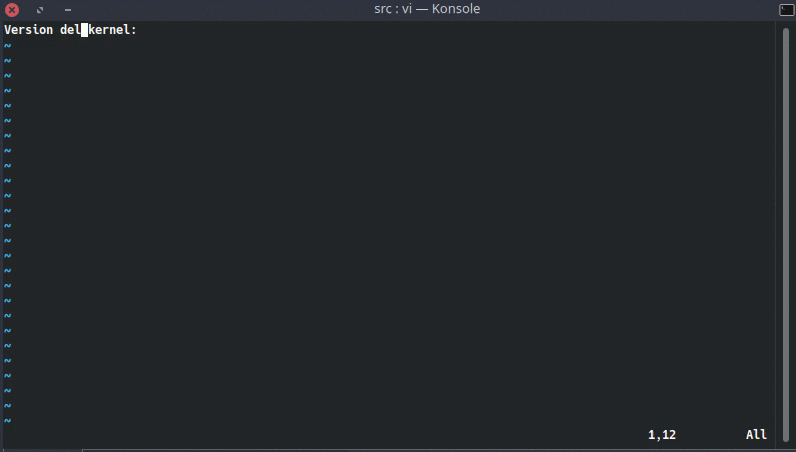
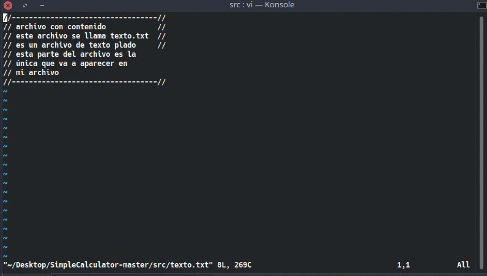

# Algunos comandos de Vim

#### El comando *:!*

El comando *:!* es usado para ejecutar comandos de Shell mientras estas en una sesión de Vim


En la figura de arriba ejecute el comando *:! ls -la* para listar los archivos de la carpeta en la cual me encontraba, acto seguido se despliega la lista de archivos y al dar *Enter* regreso al editor, esto es particularmente útil si por ejemplo quieres ejecutar código cada vez que agregas funcionalidades al mismo.

Supongamos ahora que queremos crear un archivo de texto con información del equipo como la versión del kernel, este tipo de cosas se pueden lograr combinando el comando *:r* y *:!*, para este ejemplo particular sería con *:r ! uname -v*, el texto se insertará en el archivo en la **línea siguiente** en la cual se encuentra el cursor.



Anteriormente te dije que podías usar *:r archivo* para copiar todo el contenido de un archivo en Vim, veamos ahora como tomar solo las lineas que me interesan, esto lo haremos con ayuda de *:!*; si por ejemplo quiero tomar las líneas cinco a siete de otro archivo de texto lo puedo hacer con *:r !sed -n 5,7p archivo*


#### Comandos *Ex*, *Vex* y *Sex*

El comando *Ex* es la abreviatura de *Explore* y se usa para *explorar* dentro de la carpeta de archivos en la cual abriste Vim


En caso tal de que quieras volver al archivo anterior puedes volver a ejecutar *:Ex* y buscar el archivo, o también puedes aprovechar el *Buffer* de navegación que ya conocemos (*Ctrl +o* y *Ctrl + i* para navegar hacia adelante y hacia atrás)



Los comandos *Vex* y *Sex* son algo parecidos, *Sex* usan para abrir el directorio actual de forma horizontal y *Vex* los habré de forma vertical, de esta forma podemos abrir dos (o más) archivos en el mismo editor de Vim.

Nota: Para salir de la ventana dividida usamos *:q* (o *:wq* si queremos guardar algún cambio en el archivo que hayamos abierto)


#### El comando *spell*

El comando *spell* es utilizado para verificar la gramatica del idioma que le indiquemos, por defecto en ingles (también te voy a explicar como configurarlo para español), si quieres verificar la ortografía de tu archivo usas el comando *:set spell*, el editor resaltara las palabras que estan mal escritas. 


Ahora, ¿cómo podemos corregir los errores?, con el cursor nos paramos en la palabra que queremos corregir y presionamos las teclas *z =*, nos aparecerá una lista con las posibles opciones para corregir la palabra, seleccionamos la opción por la cual queremos remplazar la palabra y damos enter.


Si estás leyendo esto, lo más probable es que seas de aula hispana y te interese tener esta opción para corregir palabras en español, bueno veamos ahora como configurar *spell* para español, para cambiar el idioma a español se utiliza el siguiente comando *:set spelllang=es*, en este caso particular Vim te marcara un error indicando que **no** tienes el paquete del idioma instalado, algo como esto:

```vim
spellfile#LoadFile(): There is no writable spell directory.
Shall I create ~/.wim/spell

Cannot find spell file for "es" in utf-8
Do you want me to try downloading it?
(Y)es, [N]o:
```

A lo cual presionaras *y*, acto seguido en la consola te aparecerá algo como esto:

```vim
Downloading fr.utf-8.spl...
:!curl 'http://ftp.vim.org/pub/vim/runtime/spell/es.utf-8.spl' -o '/tmp/v9SMuXV/0.spl'
  % Total    % Received % Xferd  Average Speed   Time    Time     Time  Current
                                 Dload  Upload   Total   Spent    Left  Speed
"/tmp/v9SMuXV/0.spl" [noeol] 1122L, 571626C
In which directory do you want to write the file:
1. /home/youruser/.vim/spell
[C]ancel, (1):
```

A lo cual deberás presionar *1* (si presionas *Enter* cancelaras el proceso), luego te saldrá esto:

```vim
This will improve making suggestions for spelling mistakes,
but it uses quite a bit of memory.
[N]o, (Y)es:
```

Después de darle *y* creará los archivos, *~/.vim/spell/es.utf-8.spl* y *~/.vim/spell/es.utf-8.sug* en caso tal de que presiones *n* no se descaran los archivos y no tendrás los paquetes del idioma.

Una vez instalados los paquetes podrás cambiar el idioma y usar el comando como ya lo hemos visto


En el [siguiente capitulo](capitulo7.md) veremos la Configuración de Vim.
