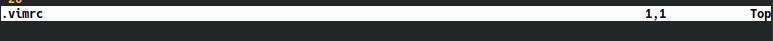

# Configuración de Vim

Ahora vamos a ver como configurar nuestro archivo *.vimrc* para personalizar nuestro editor de texto, estos son algunos de los comandos que podemos usar para ello (si, también podemos dejar un idioma por defecto para no configurar *spell* en cada archivo que abramos), configurar el archivo *.vimrc* es tan sencillo como abrirlo y escribir los comandos que queremos aplicar a nuestro editor, como se ve en esta imagen.


Nota: la  camilla (*"*) se usa para dejar comentarios.

1. *set spelllang=es* " cambia el idioma a español, siempre y cuando hayas seguido los pasos de la sección anterior

2. *set number* " para habilitar los índices de la línea en el lado izquierdo del editor
   
   

3. *set mouse=a* " para poder interactuar con el mouse (si, no estás obligado a usar solamente el teclado en Vim)
   
   

4. *syntax enable* " habilita la sintaxis de lenguaje en Vim (que resalte con colores las palabras clave del lenguaje de programación, así como los tipos de datos)

5. *laststatus=2* "habilita la barra inferior del editor (en algunas imágenes de este documento se puede ver)
   
   

6. *set sw=2* " cambia el espacio de identado a dos espacios (por defecto Vim tiene el identado en **ocho espacios**)

7. *set relativenumber* " agrega la *posición relativa del cursor* es decir a cuantas líneas por arriba o por abajo están las demás de tu posición actual.
   
   

8. *set encoding=utf-8* " coloca los archivos que crees en formato *utf-8*

9. *set wildmenu* " despliega el menú de opciones con tab
   
   

### Crear atajos o *alias*

en el archivo de configuración *.vimrc* también podrías crear atajos o *alias* para los comandos que consideras que usas mas, por ejemplo para salir de Vim usamos *:q* podríamos hacer un atajo para que sea únicamente con *q*

```vim
nmap <Leader>q :q<CR>
```

Ahora para salir del editor lo único que deberías de hacer es presionar la tecla *espacio + q*


En el [siguiente capitulo](capitulo8.md) veremos Plugins en Vim.
