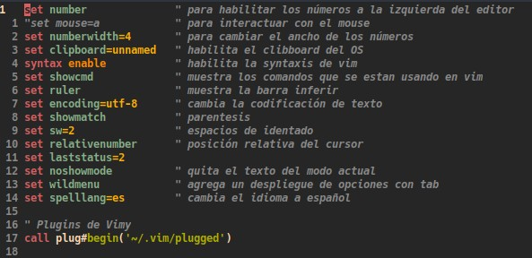

# Plugins en Vim

Para finalizar, veamos como instalar Plugins (en [2] esta el enlace de donde yo busco plugins) en Vim y revisar algunos que podrías ser útiles, otros que solo son para personalizar como por ejemplo los temas.

Para empezar debes instalar un gestor de plugins en este caso, vamos a usar [vim-plug](https://github.com/junegunn/vim-plug) puedes ir al repositorio y ver las  instrucciones para instalarlo según sea tu caso.

Una vez tengamos instalado nuestro gestor de plugings escribimos lo siguiente en nuestro archivo *.vimrc*

```vim
call plug#begin('~/.vim/plugged')
" los plugings aquí
call plug#end()
```

Ahora para cada plugin que quieras instalar debes usar la palabra clave *Plug* seguida del nombre del paquete del plugin que quieras instalar, por ejemplo para instalar el tema *forest-night* sería

```vim
call plug#begin('~/.vim/plugged')
" Temas
Plug 'sainnhe/forest-night'
call plug#end()
```

Luego debes escribir el comando *PlugInstall* para que el gestor de plugins lo instale, puedes revisar la documentación para más detalles [aquí](https://github.com/junegunn/vim-plug/wiki/tutorial)

Nota: en el caso de los temas debes de especificar que lo quieres dejar por defecto esto sería *colorscheme nombreDelTema* es decir:

```vim
call plug#begin('~/.vim/plugged')
" Temas
Plug 'sainnhe/forest-night'
call plug#end()
" Definor tema para Vim
colorscheme forest-night
```

El tema se ve así:



Un plugin que podría serte útil es nerdtree, agrega la navegación de archivos, para instalarlo, nuevamente usas la palabra clave *Plug*

```vim
call plug#begin('~/.vim/plugged')
" Temas
Plug 'sainnhe/forest-night'
" IDE
Plug 'scrooloose/nerdtree'

call plug#end()
" Definor tema para Vim
colorscheme forest-night
```

Ahora para utilizarlo debes de habilitar la *'tecla líder'*, en mi caso es un espacio (esta también es usada en otros plugins), y luego crear el atajo el *'alias'* del plugin, esto es agregar lo siguiente en *.vimrc*

```vim
call plug#begin('~/.vim/plugged')
" Temas
Plug 'sainnhe/forest-night'
" IDE
Plug 'scrooloose/nerdtree'

call plug#end()
" Definor tema para Vim
colorscheme forest-night
" Define Leader key
let mapleader=" "
nmap <Leader>nt :NERDTreeFind<CR>
```

Ahora te preguntarás, ¿cómo uso eso? es sencillo presionas *'tecla lider'* y seguido a esto presionas la combinación de teclas *nt* esto escribirá el comando *:NERDTreeFind* en la entrada de comandos ( *< CR >*  indica un *Enter*).


Ahora estarás pensando que es lo mismo que usar el comando *Vex* pero en este caso si presionas la tecla *m*, abrirás el menú de *nerdtree*, con el cual podemos gestionar los archivos (agregar, mover, eliminar, copiar, etc)

Pero para que este plugin sea un poco más útil (y de verdad tenga más diferencias con el comando *Vex o Sex*) vamos a instalar *vim-tmux-navigator* el cual nos permite navegar entre ventanas con el teclado

```vim
call plug#begin('~/.vim/plugged')
" Temas
Plug 'sainnhe/forest-night'
" IDE
Plug 'scrooloose/nerdtree'
Plug 'christoomey/vim-tmux-navigator'

call plug#end()
" Definor tema para Vim
colorscheme forest-night
" Define Leader key
let mapleader=" "
nmap <Leader>nt :NERDTreeFind<CR>
```

Con este último plugin instalado, al abrir nerdtree seleccionas el archivo que quieres abrir y con *Ctrl + l* y *Ctrl + h* podrás navegar entre las ventanas del editor. 


### Referencias y recursos

[1] *Vim: help.txt*. (n.d.). Retrieved June 23, 2020, from https://vimhelp.org/

[2] *Syntastic - Vim Awesome*. (n.d.). Retrieved June 23, 2020, from https://vimawesome.com/
